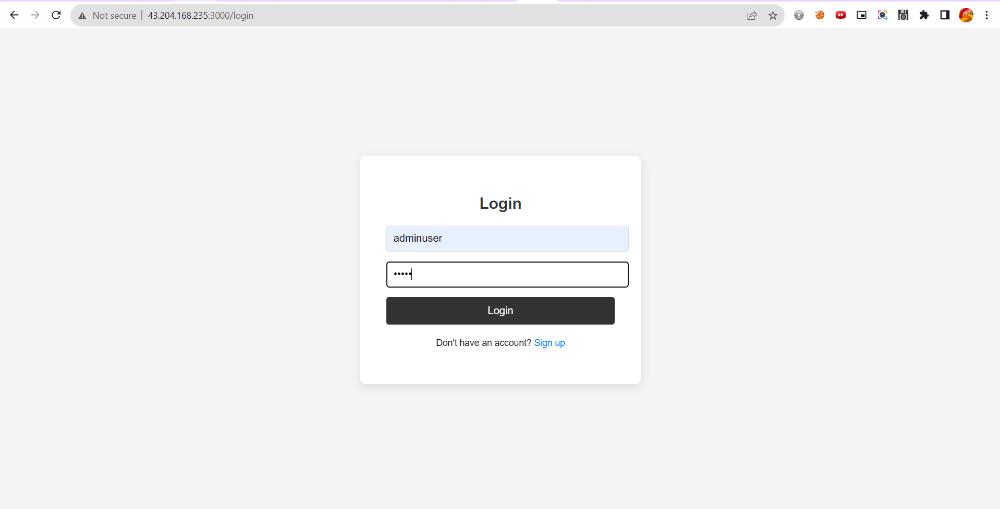
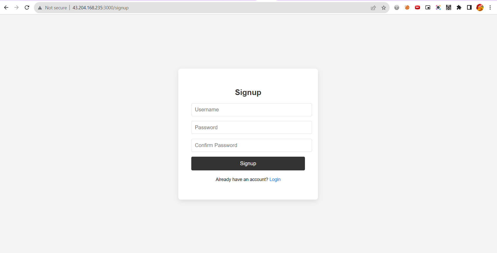
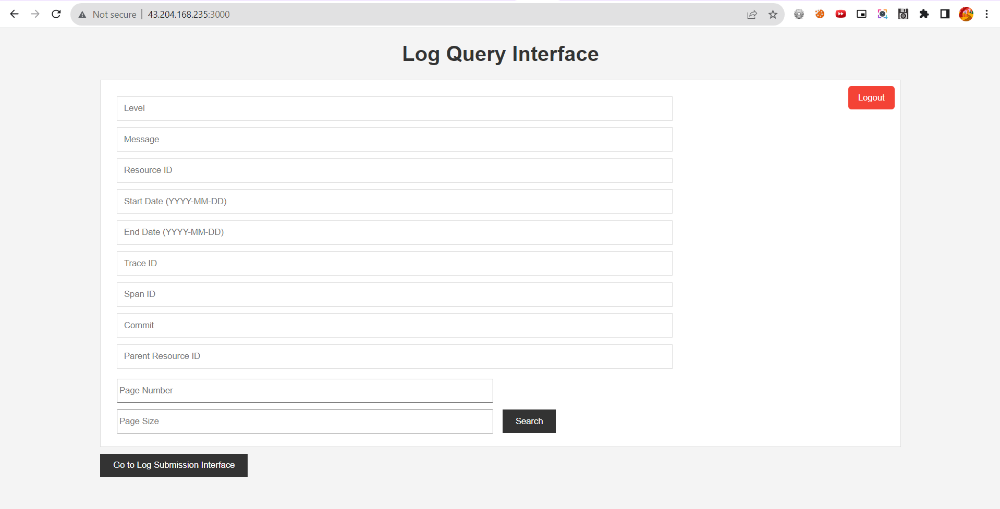
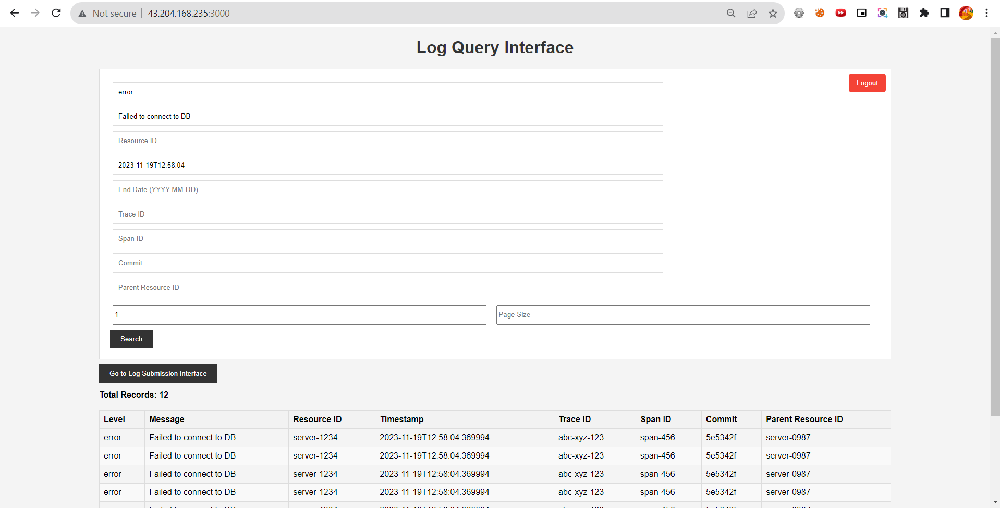
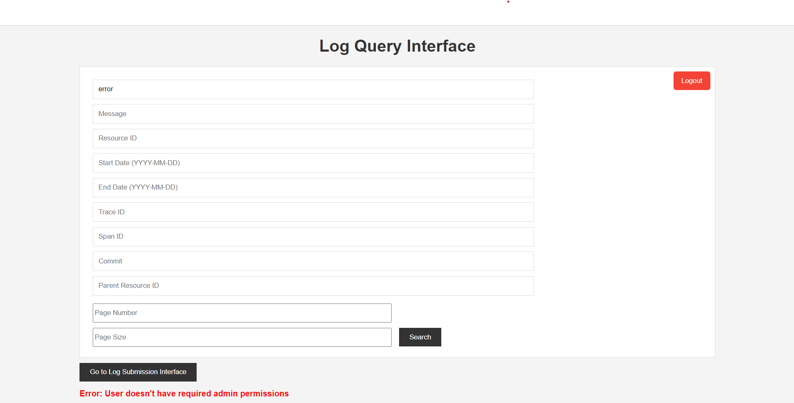
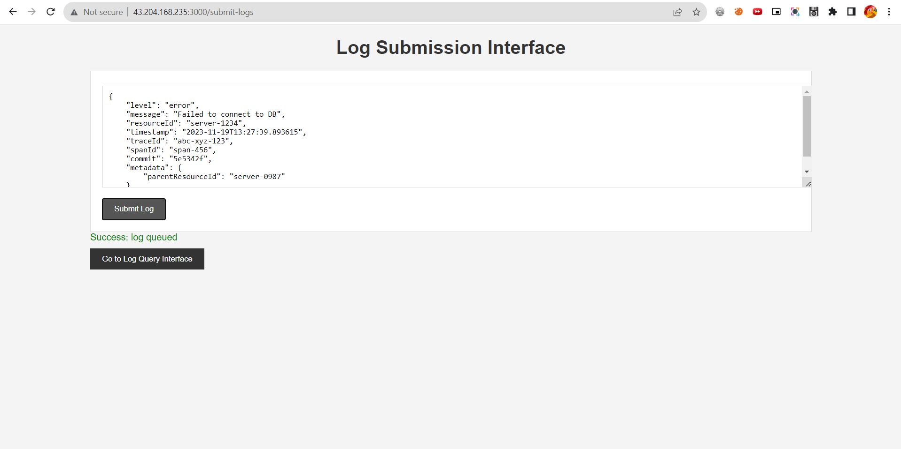
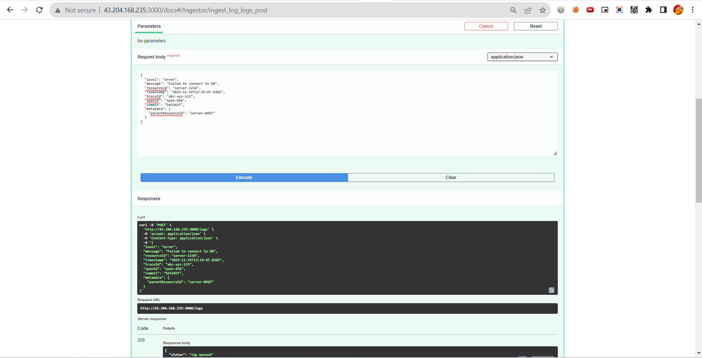

# [Log Ingestion System](http://43.204.168.235:3000)

## Introduction
This application is a Dockerized backend log ingestion system built using FastAPI. It integrates MongoDB, Elasticsearch, and RabbitMQ for log management, featuring user authentication, rate limiting, and a modular code structure for easy maintenance and scalability.

## Features

- **Dockerization:** Containerized application for easy deployment and scaling.
- **User Authentication:** Secure user authentication using JWT tokens.
- **Log Management:** Ingestion, storage, and querying of log data.
- **Rate Limiting:** Prevents API abuse and ensures fair usage.
- **Asynchronous Processing:** Utilizes asyncio for non-blocking operations.
- **Modular Architecture:** Clean separation of concerns for maintainability.


## Prerequisites


To use this application, it's essential to have Docker installed on your system. Docker will manage the creation and running of containers for the FastAPI application, Elasticsearch, and RabbitMQ. Here's a detailed guide on how to access and verify the application and its components after installation:


- **Docker:** Ensure Docker is installed on your system. Docker will be used to run the FastAPI application, Elasticsearch, and RabbitMQ in separate containers.

## Installation &amp; Running

- Clone the repository:
 ```bash 
 git clone https://github.com/dyte-submissions/november-2023-hiring-himanshkukreja
 ```


- Navigate to the project directory:
```bash
cd app
```

### Running the Application

- Run the command in the project directory. This will start all the necessary containers.
``` bash
docker-compose up --build
```
 
- After the containers are running, the application can be accessed in different ways:

### Accessing the Application

- **FastAPI Application:**
   - Open a web browser and navigate to `http://localhost:3000`.
   - You will be greeted with a login page.
   - Log in using the credentials (userId: `adminuser`, password: `admin`) to access the query interface UI.
   - For exploring and testing API endpoints, navigate to `localhost:3000/docs` where you'll find the Swagger UI documentation.


### Verifying Running Containers

- **RabbitMQ:**
   - Verify RabbitMQ is running by accessing `localhost:15672`.
   - A RabbitMQ user interface should appear. Log in with userId `guest` and password `guest`.

- **Elasticsearch:**
    - To verify Elasticsearch, go to `localhost:9200`.
    - You should see a JSON response containing Elasticsearch information, confirming that it's running.

### Important Notes

- All the services (FastAPI app, Elasticsearch, RabbitMQ) are containerized and managed by Docker, which simplifies the setup process.
- Make sure all the ports mentioned (`3000` for FastAPI, `15672` for RabbitMQ, `9200` for Elasticsearch) are free before running the application.
- The FastAPI Swagger UI provides a convenient way to interact with the API, allowing you to execute API requests directly from the browser.


## Deployed Endpoint
In addition to running the application locally using Docker, it is also accessible via a deployed endpoint:


   - The application is deployed using AWS ECS (Elastic Container Service) and ECR (Elastic Container Registry), providing a stable and scalable cloud-based environment.
   - You can access the deployed application by navigating to `http://43.204.168.235:3000 ` in your web browser, where `43.204.168.235` is the public IP assigned to AWS ECS service.
   - This deployment shares a common MongoDB Atlas database, ensuring consistent data management and availability across both local and cloud environments.
   - Log in using the credentials (userId: adminuser, password: admin) to access the query interface UI.


## Application Structure
### Directories

- **/config:** Configuration files and environment-specific settings.
- **/db:** Configuration files and folders for database client( mongoDb and ElasticSearch).
- **/controllers:** Controllers for handling request processing.
- **/routes:** Defines API routes for different functionalities.
- **/services:** Business logic and database interactions.
- **/static:** Static files like CSS for the frontend.
- **/templates:** HTML templates for user interfaces.

### Key Files

- **main.py:** Entry point for the FastAPI application.
- **Dockerfile:** Instructions for building the application's Docker image.
- **docker-compose.yml:** Defines and runs multi-container Docker applications.
- **run.py:** Script for running the application with Uvicorn.

## API Endpoints
### User Management

- **POST /register:** Registers a new user. Requires `UserCreateModel`.
- **POST /token:** Authenticates and issues an access token. Requires `OAuth2PasswordRequestForm`.

### Log Ingestion

- **POST /logs:** Submits a single log entry. Requires `LogEntry` model.
- **POST /bulk-logs:** Submits multiple log entries. Requires a list of `LogEntry` models.

### Log Querying

- **GET /search-logs:** Searches logs with filters like level, message, resourceId, etc.

### Admin Actions

- **DELETE /delete_index:** Deletes an Elasticsearch index. Requires `IndexName` model.

### User Interfaces

- **GET /**: Main query interface.
- **GET /login:** Login page.
- **GET /signup:** Signup page.
- **GET /submit-logs:** Interface for submitting logs.

## Function Descriptions
### Authentication Functions

- `authenticate_user`: Verifies user credentials.
- `create_access_token`: Generates a JWT access token.
- `get_current_user`: Retrieves the current authenticated user.

### Log Processing Functions

- `publish_message`: Publishes messages to RabbitMQ.
- `process_log_message`: Processes and stores log messages in MongoDB and Elasticsearch.
- `aio_pika_consumer`: Asynchronous RabbitMQ consumer.

### Utility Functions

- `verify_password`: Verifies a plaintext password against a hashed password.
- `get_user_by_username`: Retrieves a user from the database.

## Rate Limiting
Implemented using `slowapi` for fair API usage.

## Data Storage and Messaging
### MongoDB

- **MongoDB Atlas:** Cloud-based MongoDB service for scalable and reliable storage.
- **Database Collections:** Separate collections for logs and users.

### Elasticsearch

- **Dockerized Elasticsearch:** Official Elasticsearch Docker image for full-text search capabilities.
- **Index Management:** Dynamic indexing of log data for efficient querying.

### RabbitMQ

- **Dockerized RabbitMQ:** Utilizes the official RabbitMQ Docker image for message queuing.
- **Asynchronous Messaging:** Decouples log ingestion from processing for enhanced performance.
## Key Functionalities
### Controllers (`/controllers`)

- `auth_controllers.py`: Handles authentication-related requests.
- `ingestor_controllers.py`: Manages log ingestion requests.

### Services (`/services`)

- `auth_services.py`: Business logic for authentication.
- `log_ingestor_services.py`: Logic for log processing and storage.
- `message_queue_services.py`: RabbitMQ message handling.
- `rate_limiter.py`: Rate limiting configuration.

## Security

- JWT-based authentication for secure access.
- Passwords hashed for added security.

## Docker and Docker Compose

- **Dockerfile:** Builds a lightweight, efficient image using Python 3.9-slim.
- **docker-compose.yml:** Orchestrates the FastAPI application, Elasticsearch, and RabbitMQ services.

## Configuration (`/config`)

- `config.py`: Loads and merges configurations from YAML files.
- `application.yaml` & `secrets.yaml`: Environment-specific settings.

## Usage

- Access the application at `http://localhost:3000`.
- Use the provided API endpoints for log ingestion and user management.

## Logging

- Structured logging for monitoring and debugging.

____________________________________________________________________________
## Requirements Fulfillment
### Log Ingestor:

- **HTTP Ingestion on Port 3000:** Configured to receive log data over HTTP on the specified port.
- **Scalability and Efficiency:** Utilizes asynchronous processing and message queuing (RabbitMQ) to handle high volumes of logs without bottlenecks.
- **Database and Storage:** MongoDB for log storage, offering efficient write operations and scalability.

### Query Interface:

- **User Interface:** Web-based UI for querying logs, accessible through FastAPI.
- **Full-Text Search and Filters:** Supports searching by level, message, resourceId, timestamp, traceId, spanId, commit, and metadata.parentResourceId.
- **Efficient Searches:** Elasticsearch integration allows for fast and effective full-text searches and filtering.

## Advanced Features Implemented

- **Date Range Search:** Capability to filter logs within specific date ranges.
- **Regular Expressions in Search:** Supports regex-based searching for more complex queries.
- **Multiple Filter Combination:** Allows combining multiple filters for granular searches.
- **Real-Time Ingestion and Search:** Asynchronous processing ensures real-time log ingestion and querying.
- **Role-Based Access:** Implemented JWT-based authentication with role-based access control. The system includes a pre-registered admin user (`adminuser` with password `admin`) with access to advanced query functionalities.

## Sample Queries Supported

- Logs with a specific "error" level.
- Logs containing the message "Failed to connect".
- Logs related to a specific `resourceId`.
- Logs within a certain timestamp range (advanced feature).

## Evaluation Criteria Addressed
### Volume and Scalability

- **Asynchronous Processing:** Reduces I/O wait times, efficiently handling large volumes of data.
- **RabbitMQ:** Facilitates decoupling of log ingestion and processing, enhancing scalability.

### Speed and Efficiency

- **Elasticsearch:** Enables swift retrieval of logs based on various search criteria.
- **Optimized Querying:** Advanced indexing and search capabilities for quick results.

### Usability

- **Web UI:** Easy-to-use interface for log querying.
- **Role-Based Access:** Ensures secure access to different functionalities.

### Additional Features

- **Security:** Secure user authentication and authorization for accessing the query interface.
- **Structured Logging:** For monitoring and debugging of the application itself.

_____________________________

## Project Snapshots
Login Page



SignUp Page



Log Query Interface



Search Results



Authorization Error



Log Submission Interface



Log Submission Swagger

