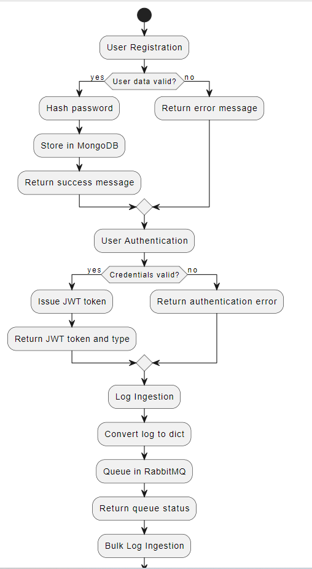

# [Log Ingestion System](http://43.204.168.235:3000)

### 1. Introduction
The log ingestion system is designed to efficiently collect, process, and store log data from various sources. Its core functionality revolves around handling incoming log data, authenticating users, and providing interfaces for querying and analyzing the logs. The system leverages FastAPI for its web framework, RabbitMQ for message queuing, MongoDB and Elasticsearch for data storage and retrieval, and implements JWT for secure authentication.

### 2. System Overview
In this system, logs are ingested through a FastAPI-based RESTful API. The logs are then queued in RabbitMQ to decouple the receipt and processing of log data. This separation ensures that the ingestion process is not immediately affected by the processing workload. Asynchronous consumers process these logs and store them in MongoDB for long-term persistence. Elasticsearch is used for indexing the log data, facilitating efficient and advanced search operations. This architecture aims to offer scalability, robustness, and efficient data handling.

### 3. Component Details

- **FastAPI Application**: The system uses FastAPI, a modern, fast web framework for building APIs. FastAPI's asynchronous support enables the system to handle a large number of concurrent API requests, making it suitable for high-throughput logging scenarios.
- **RabbitMQ**: RabbitMQ functions as a message broker in the system, ensuring reliable delivery of log messages. It helps in managing the flow of data and provides a buffer to handle surges in log data.
- **MongoDB and Elasticsearch**: MongoDB is used for storing log data and user information, offering flexibility with its schema-less structure. Elasticsearch complements this by providing a powerful search engine that allows quick retrieval and analysis of large volumes of log data.

### 4. Authentication and Authorization
JWT (JSON Web Tokens) is used for securing API endpoints. Users authenticate via OAuth2PasswordBearer, and upon successful authentication, they receive a JWT. The system enforces role-based access control, ensuring that users can only access resources and perform actions appropriate to their roles.

### 5. Logging and Error Handling
The system implements comprehensive logging, capturing essential information for monitoring and debugging. Error handling is a crucial part of the system, ensuring graceful handling of exceptions and maintaining system stability.

### 6. Rate Limiting
To prevent abuse and ensure fair usage of the API, the system incorporates rate limiting using `slowapi`. This limits the number of requests a user can make to the API within a specified time frame, protecting the system from overuse and potential denial-of-service attacks.

### 7. Static Files and Templating
FastAPI serves static files and uses Jinja2 templates for rendering HTML pages. This allows for a flexible and dynamic user interface, which can be particularly useful for administrative tasks or data visualization.

### 8. API Endpoints
The system provides a variety of API endpoints for different functionalities, including log submission, user registration, authentication, and log searching. Each endpoint is designed with specific input and output formats and is documented for ease of use.

### 9. Configuration Management
Configuration management in the system is handled in a way that avoids hardcoding sensitive information like database URLs or secret keys. This approach enhances security and makes the system more adaptable to different environments.

### 10. Concurrency and Threading
Utilizing `asyncio`, the system is designed to handle multiple operations concurrently. This is particularly evident in the handling of HTTP requests and processing messages from RabbitMQ, allowing efficient use of resources and improved performance.

### Conclusion
This log ingestion system is designed to be robust, scalable, and efficient, capable of handling high volumes of log data. Its modular architecture allows for easy maintenance and scalability. Future enhancements could include improved security measures, more advanced data analytics features, and enhanced user interfaces for log analysis.

## [Sequence Diagram](https://showme.redstarplugin.com/d/d:hN60Zz3J)

## [Feature diagram](https://mermaid.live/view#pako:eNpVkt1O4zAQhV9l5Gt4gV6slJJ0t4iKlobdi4SLwZ4kFsk4-EcCUd59Jwmi1FeWfc7xNzP-UNoZUivVehw7KPOaQVZWbTDEbL-Fh-JYNqkH2T_B9fWv051rIceIJ1hXD_j8bOPuAIdEiZ4W73qWZeGddecduxRg752mECy3J7ipdo5bl68v5Fs29Dbf51XRy9tWB0Kvuy9VUT0G8pCl2BHLJUbreAG6_VdC6V6IwwmyRb0RskhwZwcbJXTRzdXQa6IQYYeMLQ0S9e35XR2jpGrY2J4CIBsoaRh7PCc8TgEC6mfQL9-fagou2IzOcgyL8i96OxW-SawnUuwFhM6A2-rGcWPb5OdCfvAs_iPp5AkuRGf37eQWgSfW7wtp5wnNN2jRNFZbSYP7kS7dNasrNZAf0BoZ-8d8pqSrA9VqJVtDDaY-1qrmT5Fiiu4oo1Sr6BNdqTQaaW1uUT7McHlYGBudV6sG-0Cf_wEw28wx)

## [Activity diagram](https://showme.redstarplugin.com/d/d:6xIRa5cM)

## API Endpoints Detailed Explanation

- **User Registration (`/register`)**
   - **Purpose**: Allows new users to register in the system.
   - **Method**: POST
   - **Input**: Requires `UserCreateModel`, which includes the username, password, and roles.
   - **Process**: The password is hashed, and the new user data is stored in MongoDB.
   - **Output**: Confirmation message indicating successful registration.
- **User Authentication (`/token`)**
   - **Purpose**: Authenticates users and provides a JWT token.
   - **Method**: POST
   - **Input**: `OAuth2PasswordRequestForm` data containing username and password.
   - **Process**: Validates user credentials against the database and, if valid, issues a JWT token.
   - **Output**: A JWT token and token type.
- **Log Ingestion (`/logs`)**
   - **Purpose**: Endpoint for ingesting individual log entries.
   - **Method**: POST
   - **Input**: A `LogEntry` model, which includes log details like level, message, and timestamp.
   - **Process**: Converts log entry to a dict, queues it in RabbitMQ for processing.
   - **Output**: Status message indicating the log entry is queued.
- **Bulk Log Ingestion (`/bulk-logs`)**
   - **Purpose**: For ingesting multiple log entries at once.
   - **Method**: POST
   - **Input**: A list of `LogEntry` models.
   - **Process**: Each log entry is converted to a dict and queued in RabbitMQ.
   - **Output**: Status message indicating the number of log entries queued.
- **Log Query Interface (`/`)**
   - **Purpose**: Serves a web interface for querying logs.
   - **Method**: GET
   - **Output**: Renders a Jinja2 template for querying logs.
- **Validate Token (`/validate-token`)**
   - **Purpose**: Validates a provided JWT token.
   - **Method**: GET
   - **Input**: JWT token.
   - **Process**: Decodes and validates the JWT token.
   - **Output**: Message indicating whether the token is valid.
- **Search Logs (`/search-logs`)**
   - **Purpose**: Allows searching through indexed logs in Elasticsearch.
   - **Method**: GET
   - **Input**: Query parameters for filtering logs (e.g., level, message, date range).
   - **Process**: Constructs an Elasticsearch query and retrieves matching logs.
   - **Output**: Search results along with total count.
- **Delete Index (`/delete_index`)**
   - **Purpose**: Deletes a specified index from Elasticsearch.
   - **Method**: DELETE
   - **Input**: Index name.
   - **Process**: Sends a delete request to Elasticsearch for the specified index.
   - **Output**: Elasticsearch response or error message.

## Identified issues that are present in the system

- **Scalability and Performance Under High Load**: While the system is designed to be scalable, the actual performance under high loads, especially during peak times, needs to be monitored. The use of RabbitMQ for queuing and MongoDB for storage is beneficial, but these components can become bottlenecks if not properly scaled or configured.

- **Security Vulnerabilities**: The system uses JWT for authentication, which is generally secure, but it's crucial to ensure that the implementation of JWT and OAuth2PasswordBearer is robust against common security threats like token hijacking or replay attacks.

- **Data Integrity and Loss Prevention**: The process of transferring logs from RabbitMQ to MongoDB and Elasticsearch must ensure data integrity. There's a risk of data loss if the system fails to process some log entries due to unexpected errors or crashes.

- **Complexity in Error Handling**: Given the multiple components involved (FastAPI, RabbitMQ, MongoDB, Elasticsearch), comprehensive error handling can become complex. Ensuring that errors are not only caught but also properly logged and addressed is crucial for system stability.

- **Dependency Management**: The system relies on several external services and libraries. Keeping these dependencies updated and managing compatibility can be challenging, especially when dealing with breaking changes in major updates.

- **Resource Utilization and Optimization**: The system's efficiency in resource utilization (CPU, memory, network bandwidth) should be regularly evaluated, especially when handling large volumes of log data.

- **Rate Limiting Strategy**: While the system uses slowapi for rate limiting, the strategy must be carefully calibrated to balance between preventing abuse and not hindering legitimate high-frequency requests.

- **Backup and Recovery**: The strategy for data backup and recovery needs to be robust to handle scenarios like data corruption or system failures.

- **Monitoring and Alerting**: Continuous monitoring of the system's health and performance is essential. The system should have a robust alerting mechanism for any anomalies or failures.
